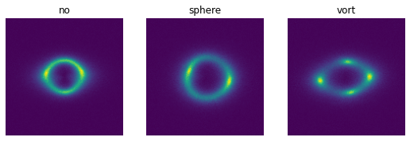
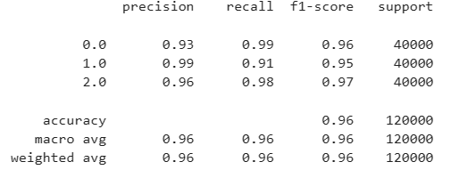
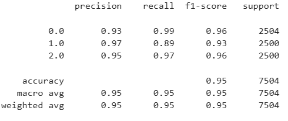
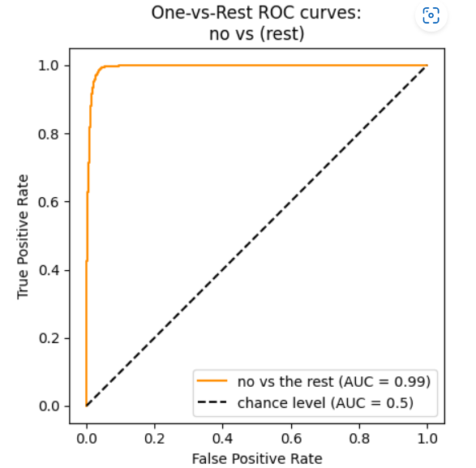
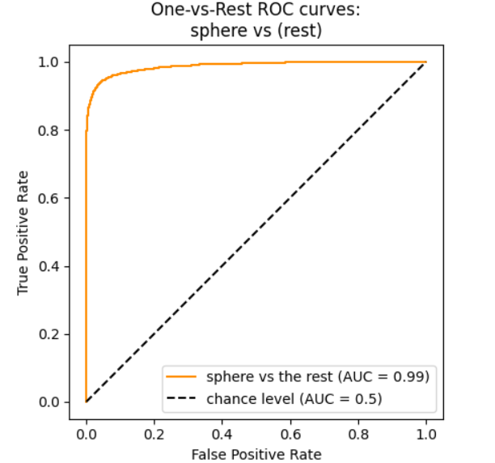
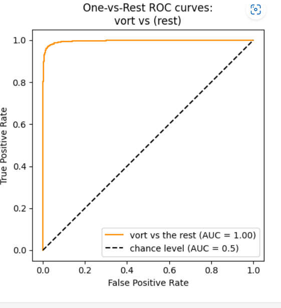

# Common Test I. Multi-Class Classification

The "Common Test I. Multi-Class Classification" has a Strong lensing images dataset containing 3 classes. 
1. No substructure - 
2. Subhalo substructure
3. Vortex substructure  

The dataset contains a total of 30000 training images (10000 for each class) and 7503 validation images. An example of the images are

I have added a few transformations like random rotation, horizontal flip, vertical flip to augument the training dataset. In addtion to this, the images have been cropped so that there is no blank space left. The new image dimensions are 90x100. 

The model chosen is Resnet, with a modified input convolution and classification head. I use pytorch lightning to automate the training loop. 

## Metrics

I first test the model using scikit-learn classification report, to see if we are overfitting the model or not. The reports are as follows:

### Train set report

### Test set report

## ROC curves and AUC scores 

The ROC curves and AUC scores are plotted for the test set. The following are the curves

### No substructure vs rest

### Subhalo substructure vs rest

### Vortex substructure vs rest

All code is present in the jupyter notebook