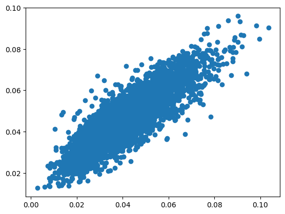
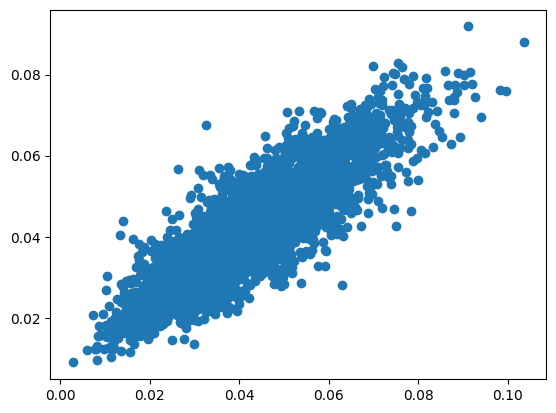

# Specific Test III. Learning Mass of Dark Matter Halo 

The "Specific Test III. Learning Mass of Dark Matter Halo" is a deep regression challenge. We are given input images and its corresponding dark matter halo mass. 

The dataset has 20000 images. I have applied 4 transforms that will be randomly selected for every epoch. This is not augumenting the dataset directly, but aids with generalisation because at every epoch, a different image will be present in the training set. 

The model chosen is Resnet with a modified input convolution and regression head. I have trained the model with a smooth l1 loss and mse loss to see what would be the difference in performance. 

# Results

| Dataset | MSE       | MAE     | RMSE  | r2    |
|---------|-----------|---------|-------|-------|
| Train (L1)   | 6.044e-05 | 0.00644 | 0.007 | 0.659 |
| Test   (L1) | 7.815e-05 | 0.00724 | 0.008 | 0.527 |
| Train (MSE)   | 2.267e-05 | 0.0035 | 0.004 | 0.875 |
| Test   (MSE) | 5.384e-05 | 0.00564 | 0.007 | 0.664 |

I have plotted the true points with the predicted points for both test sets. The plots are as follows

## Test set using L1 loss

## Test set using MSE loss

As we see, both predictions are good as they lie along the 45 degree slope. However, the metrics show that the MSE loss model is more accurate. 