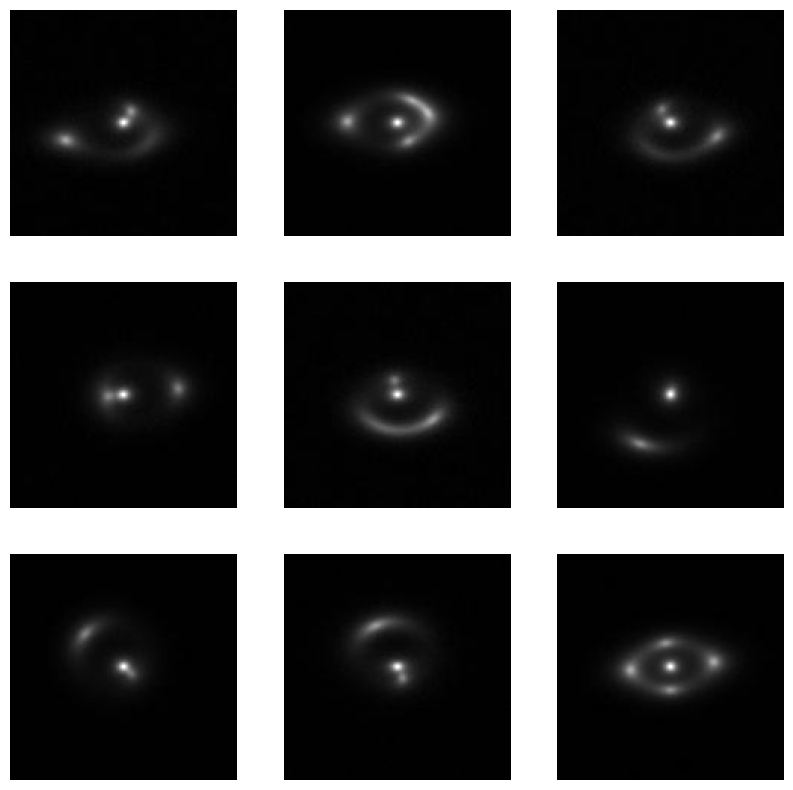
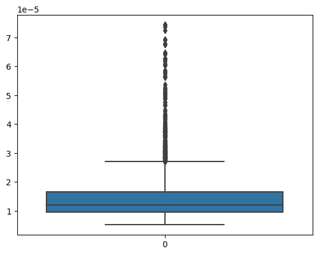
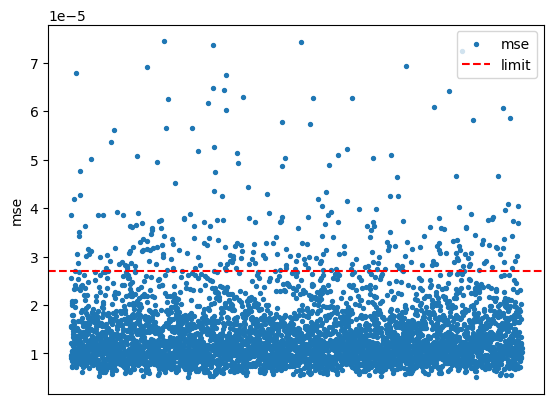

# Specific Test V. Exploring Transformers

The "Specific Test V. Exploring Transformers" is a test to explore use of transformers with strong lensing images. The task is to identify anomalous strong lensing images with no substructure. To do so, we must model the distribution of images and find the out-of-distribution images. Auto-encoders have a neat trick where they can reconstruct images from a latent bottleneck vector, making them particularly useful for the task. The latent vector encodes a bottleneck distribution of data and it is used for reconstruction. If any image is out of distribution, the latent vector will still be part of the distribution, thus the image reconstructed will have a lot of difference from the input image. A mean-squared difference between these images will serve as our detection statistic. We find a threshold mse using the train set, by using box-plot values and apply it on the test set. Any mse greater than this threshold will detect an image as anomalous. Some non-anomalous images (detected) are shown:

Vision transformers have shown great performance for various image-related tasks. The huggingface library does not provide a simple implementation for auto-encoders, which are basically image-to-image tasks. Thus, I make use of pytorch VisionTransformers with a custom decoder for reconstructing images. The patch embeddings are used to reconstruct the images. The decoder uses pixel-shuffler layers to aid with up-sampling. 

Since this is un-supervised anomaly detection, we have no classification metric for measuring performance. To see how well our model performs, we make use of ssim and psnr on the reconstructed test set images as a performance measure. If the psnr and ssim are low, it means that our model performs poor reconstruction and is not suitable for anomaly detection. The ssim and psnr obtained are 0.997 and 47.53 respectively, which is sufficient for image reconstruction. 

A boxplot helps us visualize the outliers. The following is the boxplot on the training set:

The next image shows a scatter plot of all MSE values collected for the training set and the threshold, giving a visualization of the percentage of points detected as anomalies.

The anomalous images detected on the test set are as follows:

