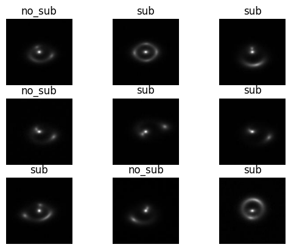
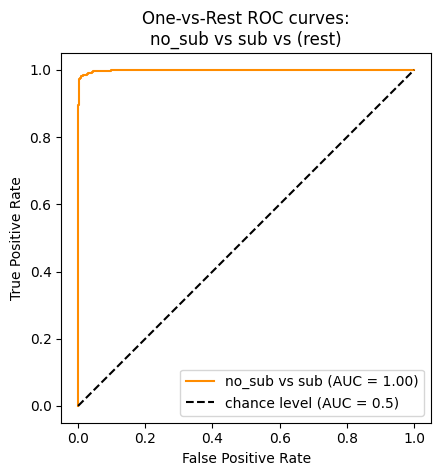

# Specific Test V. Exploring Transformers

The "Specific Test V. Exploring Transformers" is a test to explore use of transformers with strong lensing images. The task was to classify images into 2 classes - no substructure and substructure. Every image has a dimension of 150x150, and we are given a total of 10000 such images. An example of the dataset is: 

Vision transformers have shown great performance for various image-related tasks. Classification using transformers can be implemented using the huggingface library. For this task, I have chosen to train the transformer from scratch and not fine-tune a pretrained model because the images are very domain specific and not part of the dataset on which any vision transformer is trained on (example MSCOCO, ImageNet). Since it is domain specific and the images do not have a lot of objects, we can do with a smaller transformer having less attention heads and hidden layers. I have chosen 3 attention heads and hidden layers for this task, and get 98.3% accuracy on the test set (90/10 split). 

The ROC curve and AUC score is as follows: 

The results are promising, and a comprehensive hyper-parameter search could yield to more efficient model. 