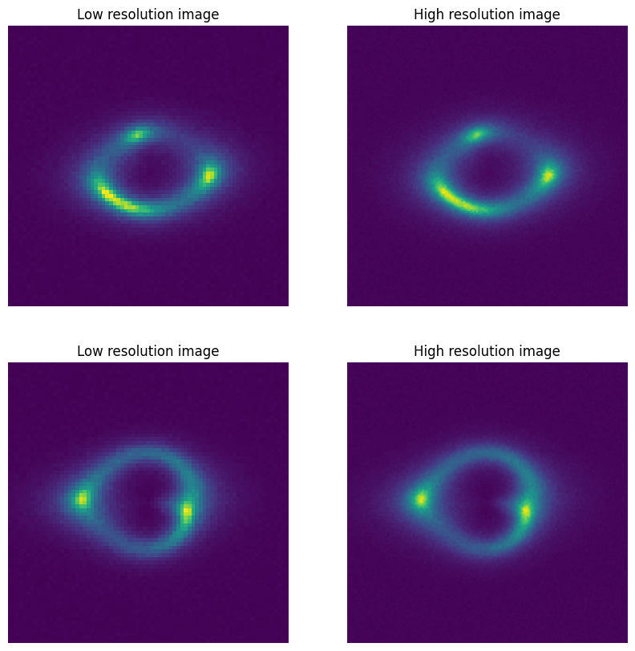
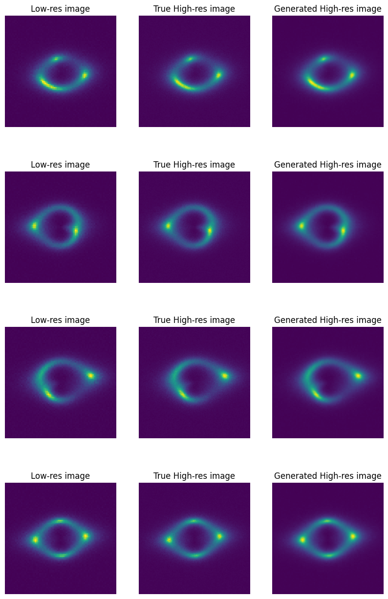

# Specific Test VI. Image Super-resolution 

The "Specific Test VI. Image Super-resolution" has a dataset of low resolution and high resolution strong lensing images. The low resolution images have a dimension of 75x75 and the high resolution images is 150x150, which is a 2x upscale. The dataset has a total of 2000 such pairs. 

While 2000 might be significantly less training pairs, upon observation, we can see that all images are similar. Thus, we do not need to augument the dataset. An example of the images are as follows:

There are multiple deep learning based solutions for image super-resolution. To solve this challenge, I have implemented the [SRGAN](https://arxiv.org/abs/1609.04802) architecture. The SRGAN network was trained on a very large image dataset because its task is significantly different, it has to enhance images with much finer details and texture, thus needs to understand the underlying semantics. Our dataset does not have the same problem, thus we can get away with a smaller dataset size. 

I first train the generator with a mean squared error loss, then train the generator and discriminator using the GAN framework. I have replaced the content loss with MSE loss because we dont have a pretrained network to extract embedded representations. Upon training, we observe that the model starts to underperform when trained with the discriminator. 

# Results

Some qualitative metrics have been listed below

|                | MSE       | PSNR  | SSIM  |
|----------------|-----------|-------|-------|
| Generator only | 6.024e-05 | 42.2  | 0.995 |
| GAN framework  | 8.827e-05 | 40.54 | 0.992 |

The results visually are not different. The results from Generator only training are in the following figure

